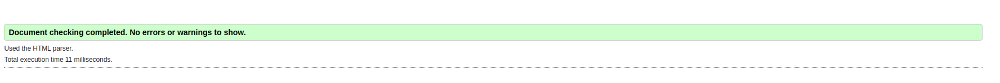

# Project 6 (Julien Lamalle)

### For this project we implemented the front-end for an API to display the best movies by rating or by category


To clone this folder, execute the following command: 


```
git clone git@github.com:JulienLamalle/OC_DA_PYTHON_P6.git
```

From your terminal you can enter the file as follows: 


```
cd OC-DA-PYTHON_P6
```

In order to retrieve the data and display it via the front-end, you need to clone this repository and start the API : 


```
https://github.com/OpenClassrooms-Student-Center/OCMovies-API-EN-FR
```

To do this, follow the instructions shared in the readme of the above-mentioned repository

After that, you can access the front-end application from the `index.html` file located in the `src` folder

You can see W3C validator screenshoot here : 

<p align="center">
  
</p>